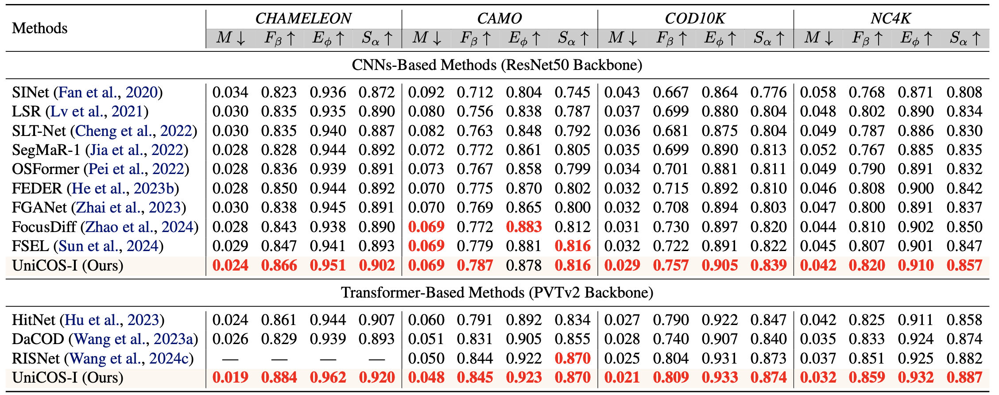
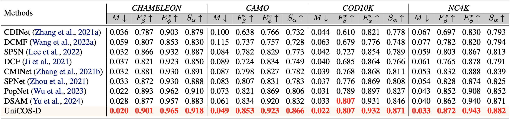
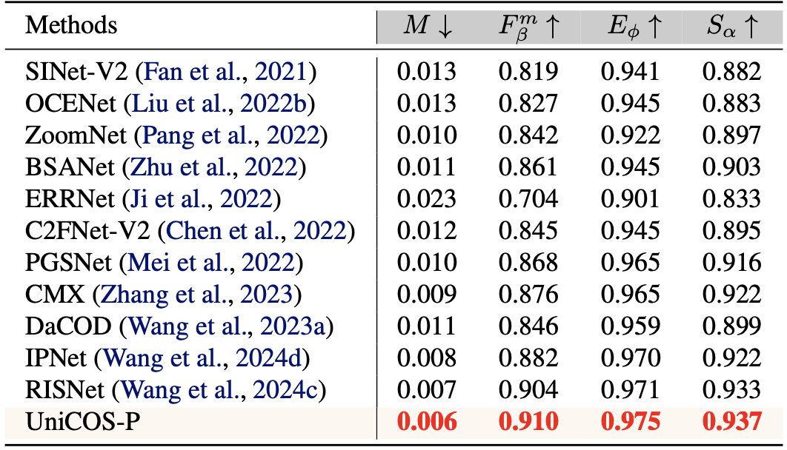
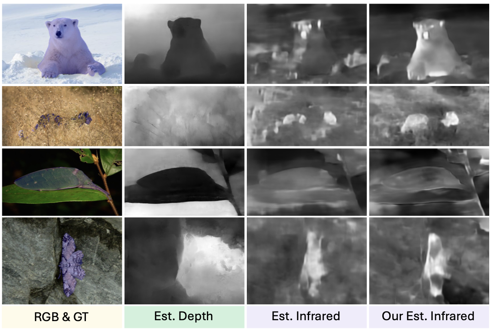
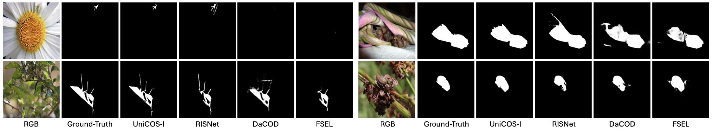
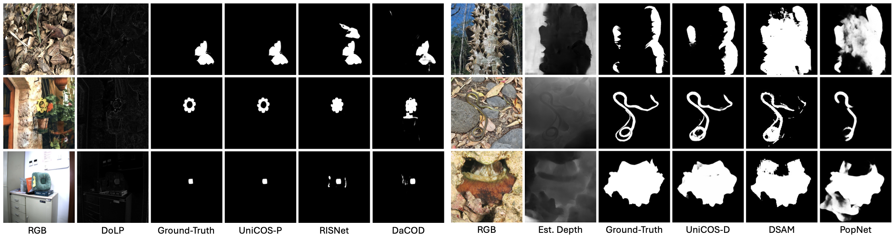

<p align=center> </p>

# <p align=center> `UniCOS` </p> 

<b><p align=center> <a href='https://arxiv.org/abs/2502.14471'></a></p></b>

This is the official PyTorch codes for the paper. 
>**Integrating Extra Modality Helps Segmentor Find Camouflaged Objects Well** <br> [Chengyu Fang](https://cnyvfang.github.io/), [Chunming He](https://chunminghe.github.io/), Longxiang Tang, Yuelin Zhang, Chenyang Zhu, Yuqi Shen, Chubin Chen, Guoxia Xu, Xiu Li, arXiv 2025<br>

**Abstract:** Camouflaged Object Segmentation (COS) remains a challenging problem due to the subtle visual differences between camouflaged objects and backgrounds. Owing to the exceedingly limited visual cues available from visible spectrum, previous RGB single-modality approaches often struggle to achieve satisfactory results, prompting the exploration of multimodal data to enhance detection accuracy. In this work, we present UniCOS, a novel framework that effectively leverages diverse data modalities to improve segmentation performance. UniCOS comprises two key components: a multimodal segmentor, UniSEG, and a cross-modal knowledge learning module, UniLearner. UniSEG employs a state space fusion mechanism to integrate cross-modal features within a unified state space, enhancing contextual understanding and improving robustness to integration of heterogeneous data. Additionally, it includes a fusion-feedback mechanism that facilitate feature extraction. UniLearner exploits multimodal data unrelated to the COS task to improve the segmentation ability of the COS models by generating pseudo-modal content and cross-modal semantic associations. Extensive experiments demonstrate that UniSEG outperforms existing Multimodal COS (MCOS) segmentors, regardless of whether real or pseudo-multimodal COS data is available. Moreover, in scenarios where multimodal COS data is unavailable but multimodal non-COS data is accessible, UniLearner effectively exploits these data to enhance segmentation performance.   


<details>
<summary>🏃 The architecture of the proposed UniCOS</summary>
<center> 
    
</center>
</details>


## 🔥 News
- **2025-02-21:** We release a part of results, bibtex, and the preprint of full paper.
- **2025-02-10:** We release this repository, the preprint of full paper will be release soon.


## 🔧 Todo

- [ ] Complete this repository


## 🔗 Contents

- [ ] Datasets
- [ ] Training
- [ ] Testing
- [x] Results
- [x] Citation

## 🔍 Results

We achieved state-of-the-art performance on _COD10K_, _CAMO_, _NC4K_, _CHAMELEON_, and _PCOD1200_. More results can be found in the paper. We will release all results from different datasets when the paper is accepted.

<details>
<summary>Quantitative Comparison (click to expand)</summary>

- Quantitative results on UniCOS-Infrared and other methods.
  <p align="center">
  
  </p>
- Quantitative results on UniCOS-Depth and other methods. 
  <p align="center">
  
  </p>
- Quantitative results on UniCOS-Polarization and other methods.
  <p align="center">
  
  </p>  
  </details>

<details open> 
<summary>Visual Comparison (click to expand)</summary>

- Visual results on UniLearner
  <p align="center">
  
  </p>
- Visual comparison on RGB and RGB-I
  <p align="center">
  
  </p>
- Visual comparison on RGB-P and RGB-D
  <p align="center">
  
  </p>
  
  </details>


## 📎 Citation

If you find the code helpful in your research or work, please cite the following paper(s).

```
@misc{fang2025unicos,
      title={Integrating Extra Modality Helps Segmentor Find Camouflaged Objects Well}, 
      author={Chengyu Fang and Chunming He and Longxiang Tang and Yuelin Zhang and Chenyang Zhu and Yuqi Shen and Chubin Chen and Guoxia Xu and Xiu Li},
      year={2025},
      eprint={2502.14471},
      archivePrefix={arXiv},
      primaryClass={cs.CV},
      url={https://arxiv.org/abs/2502.14471}, 
}
```

