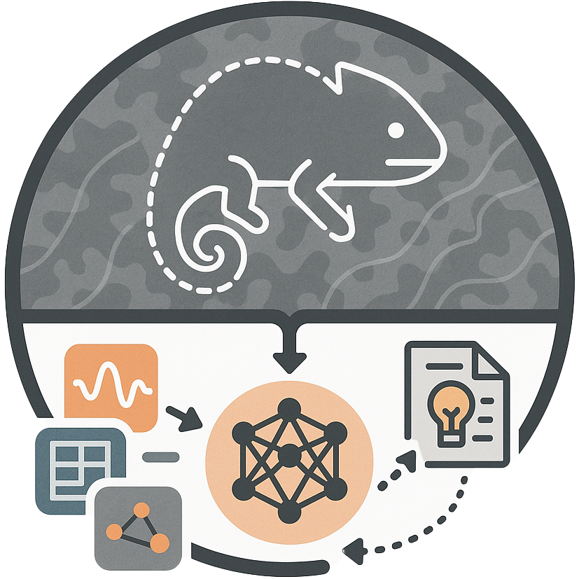
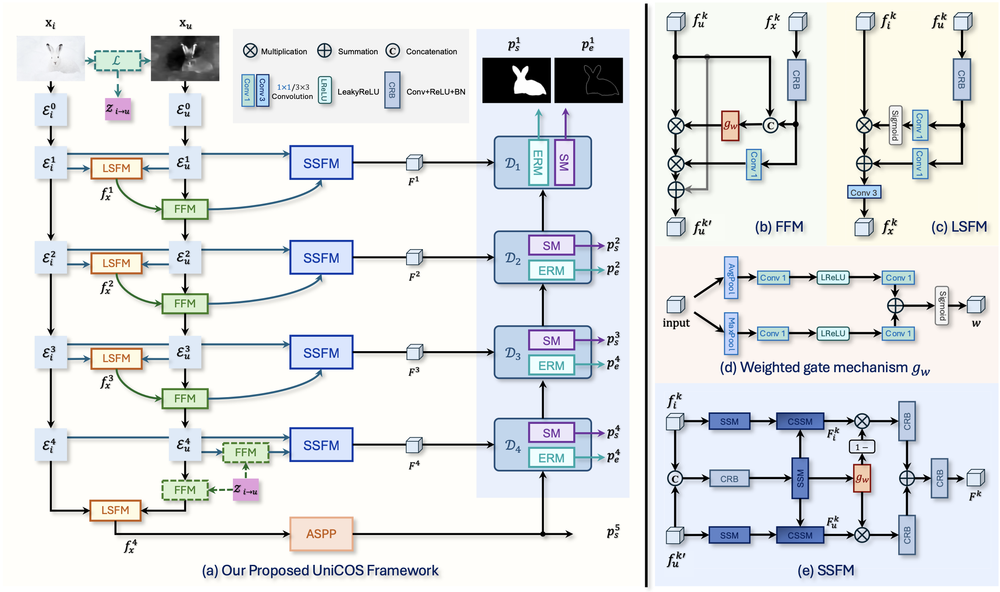

<p align=center> </p>

> **MultiCOS: Unlocking the Potential of Limited Multimodal Data on Camouflaged Object Segmentation** <br> <br> 
> [Chengyu Fang](https://cnyvfang.github.io/), [Chunming He](https://chunminghe.github.io/), Yuqi Shen, Chenyang Zhu, Yuelin Zhang, Fengyang Xiao, Longxiang Tang, Chubin Chen, Xiu Li, arXiv 2025<br><br> 
>**Abstract:** Domain-to-domain translation and downstream segmentation are naturally complementary: translation captures cross-domain visual correspondence, while segmentation provides high-level semantics that guide translation toward more task-relevant representations. Camouflaged Object Segmentation particularly benefits from this synergy, as camouflaged objects exhibit subtle differences from their surroundings and single-modality RGB cues are often insufficient. We propose a multitasking framework MultiCOS, enabling mutual knowledge learning between domain translation and COS. MultiCOS comprises a Plug-and-play Domain Translator (PDT) for generating complementary pseudo-modal inputs and a Multimodal Camouflage Segmentor (MCS) for cross-modal segmentation with bi-space fusion and feedback refinement. The PDT supplies multimodal cues to the MCS, while the MCS returns high-level semantic feedback that steers translation toward camouflage-aware generation. Experiments on standard COS benchmarks show that our framework outperforms unimodal and multimodal baselines, yielding stronger representations, better camouflage perception, and improved translation performance through bidirectional feedback. MultiCOS can also operate independently when real multimodal data are available, achieving competitive results among existing methods. <br><br>
> **Arxiv Version (Out-of-date):** <a href='https://arxiv.org/abs/2502.14471'></a>


<!-- <details>
<summary>🏃 The architecture of the proposed UniCOS</summary>
<center> 
    
</center>
</details> -->


## 🔥 News
- **2025-02-21:** We release a part of results, bibtex, and the preprint of full paper.
- **2025-02-10:** We release this repository, the preprint of full paper will be release soon.


## 🔧 Todo

- [ ] Complete this repository


## 🔗 Contents

- [ ] Datasets
- [ ] Training
- [ ] Testing
- [ ] Results
- [ ] Citation


## 📎 Citation

If you find the code helpful in your research or work, please cite the following paper(s).

```
@misc{fang2025multicos,
      title={Integrating Extra Modality Helps Segmentor Find Camouflaged Objects Well}, 
      author={Chengyu Fang and Chunming He and Longxiang Tang and Yuelin Zhang and Chenyang Zhu and Yuqi Shen and Chubin Chen and Guoxia Xu and Xiu Li},
      year={2025},
      eprint={2502.14471},
      archivePrefix={arXiv},
      primaryClass={cs.CV},
      url={https://arxiv.org/abs/2502.14471}, 
}
```

